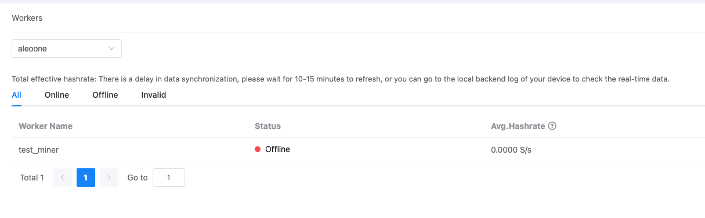

# Pool Mode

## 1. Register and add new account

1. Login [Aleo Pool](https://aleopool.xyz)，and complete the registration;
2. Go to "Dashboard" and click "Add Account" on the "Miners" page

<figure><figcaption></figcaption></figure>

&#x20;3\. Record and save your mining account names

## **2. Recommend Hardware**

* **CPU:** 4 cores CPU
* **GPU:** 2080Ti/3080/3090\*8
* **VRAM:** 5G or more
* **RAM：**8G/GPU
* **SSD：**128G
* **Need to install the latest graphics card driver, currently only support NVIDIA graphics cards**

## **3. Download aleo-pool-prover**

**Latest update: 2023-01-09**

* [Ubuntu 18.04 (GPU) ](https://nd-valid-data-bintest1.oss-cn-hangzhou.aliyuncs.com/aleo/aleo-pool-prover\_ubuntu\_1804\_gpu)
* [Ubuntu 18.04 (CPU)](https://github.com/aleo-pool/prover/releases/download/v1.1.0/aleo-pool-prover\_ubuntu\_1804\_cpu)
* [Ubuntu 20.04 (GPU)](https://nd-valid-data-bintest1.oss-cn-hangzhou.aliyuncs.com/aleo/aleo-pool-prover\_ubuntu\_2004\_gpu)
* [Ubuntu 20.04 (CPU)](https://github.com/aleo-pool/prover/releases/download/v1.1.0/aleo-pool-prover\_ubuntu\_2004\_cpu)
* [Windows (CPU)](https://github.com/aleo-pool/prover/releases/download/v1.1.0/aleo-pool-prover\_cpu\_windows.exe)
* [Apple (Intel)](https://github.com/aleo-pool/prover/releases/download/v1.1.0/aleo-pool-prover\_cpu\_x86\_64-apple-darwin)
* [Apple (Silicon)](https://github.com/aleo-pool/prover/releases/download/v1.1.0/aleo-pool-prover\_cpu\_aarch64-apple-darwin)

## 4. Run aleo-pool-prover

1. Enter Directory of aleo-pool-prover&#x20;
2. Running following codes

```
./aleo-pool-prover_ubuntu_1804_gpu --account_name test_account --miner_name test_miner
#Make sure the prover name as same as you downloaded one
#Replace "test_account" with your mining account name
#"test_miner" with a customizable one for web-based device differentiation.
```

3\. If you need to adjust the resource usage, you can add after the command line

```
-j number of tasks (default is 1) -t number of threads for a single task
```

4\. If dual GPUs are used, each GPU starts a process and the GPU used for the current process is controlled by the CUDA\_VISIBLE\_DEVICES environment variable

```
export CUDA_VISIBLE_DEVICES=0
./aleo-pool-prover_ubuntu_1804_gpu --account_name test_account --miner_name test_miner
export CUDA_VISIBLE_DEVICES=1
./aleo-pool-prover_ubuntu_1804_gpu --account_name test_account --miner_name test_miner
```

## 5. Start Mining

After configuration, the miners will be automatically added to your Aleo pool in about 1 minute, and the tested power speed can be viewed in real time in the device backend. You can also view it on the Aleo Pool webpage. The statistics on the web side is the average computing power of 15 minutes, so the data will be synchronized with the backend data after 15 minutes.

<figure><figcaption></figcaption></figure>

## 6. FAQ

### Q1. What if I encounterd "Permission Denied"?

```
#Run the following command
#Make sure the software name is correct
chmod +777 ./aleo-pool-prover_ubuntu_1804_gpu
```

### Q2. Cuda Error?

Currently, we recommend you to download NVIDA version above 515.

### Q3. "error while loading shared libraries: libssl.so.1.1"

```
#Install the following package
http://nz2.archive.ubuntu.com/ubuntu/pool/main/o/openssl/libssl1.1_1.1.1f-1ubuntu2.16_amd64.deb
```
